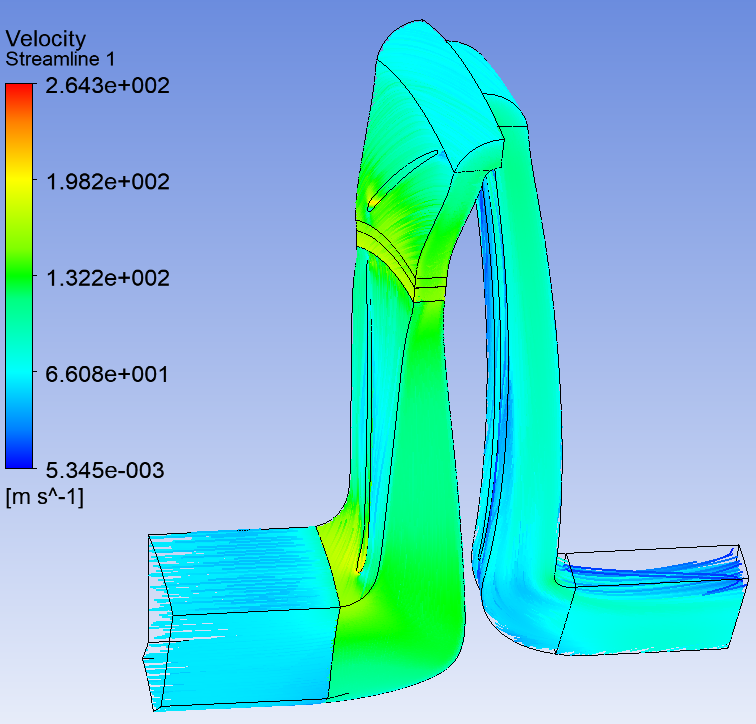

# Compressor_calc_data

This is a desktop application for post-processing of centrifugal compressor stage calculation results. 

<p align="center"> 
  
</p>

## Overview

<p align="justify"> 
  This program is designed to plot stage characteristics depending on the conditional flow rate based on the results of gas-dynamic calculation of the centrifugal compressor stage in the Ansys CFX program. To carry out the calculation, it is necessary to download tables with gas-dynamic calculation data (.txt or .csv format). The table should indicate the parameters in sections. An example of tables for different mass flow rates is given in the example_import_data folder. In the Import data section, you need to add a table using the Add table button. If the Data valid column contains the inscription Data is valid, then the data from the file was read without errors, if - Error, then the data was not read and the calculation will not start. In the Calc data section, you must enter additional data for the calculation. In the Proc data section, you can save the table with the calculation results to a text file using the Save button, and using the Show button, you can view the graphs of the found values. Examples of processing data in the <a href="https://github.com/DmitriyKhudiakov/Compressor_calc_data/tree/main/example_import_data">example_import_data</a> folder are shown in the figure below.
</p>

<p align="center"> 
     
</p>


## Dependencies
Python 3.7+.<br/>
All dependencies are in the file requirements.txt.


## Installation
Clone this repo
```bash
git clone https://github.com/DmitriyKhudiakov/Compressor_calc_data.git
```
Install libs
```bash
pip install -r requirements.txt
```

## Usage
Launch app
```bash
main.py
```
The description of how the application works is located inside the application. 


## License
[MIT](https://choosealicense.com/licenses/mit/)
